# loutskiy.github.io
Для ВУЗа

# Лабараторная работа 1
[Ramus файл](https://github.com/loutskiy/loutskiy.github.io/blob/master/sixq.rsf)

[Скрин ramus файла](https://github.com/loutskiy/loutskiy.github.io/blob/master/Шесть%20вопросов.png)

[Диаграмма классов](https://github.com/loutskiy/loutskiy.github.io/blob/master/Диаграмма%20классов.png)

[Диаграмма прецедентов](https://github.com/loutskiy/loutskiy.github.io/blob/master/Диаграмма%20прецедентов.png)

# Лабароторная работа 2
[Ramus файл](https://github.com/loutskiy/loutskiy.github.io/blob/master/laba2)

# Лабораторная 4-6

### [.rsf](course-2.rsf)

* Формальное определение объекта моделирования: Процесс "Построение туристических маршрутов"
* Формальное определение точки зрения: Владелец системы
* Формальное определение цели моделирования: спроектировать процесс взаимодействия пользователя с приложением
* Формальное определение темы курсового проекта: Проектирование информационной системы построения туристических маршрутов на основе интересов пользователя

### IDEF

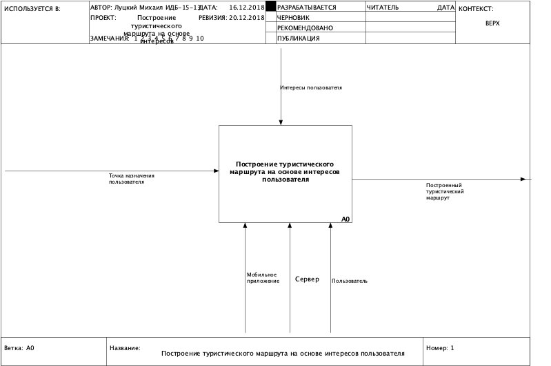

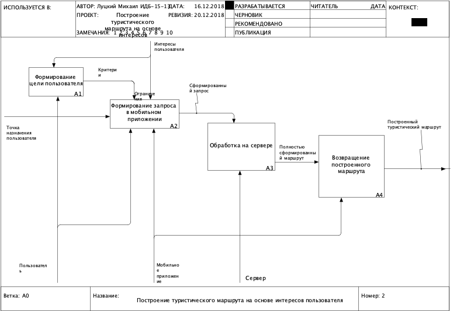

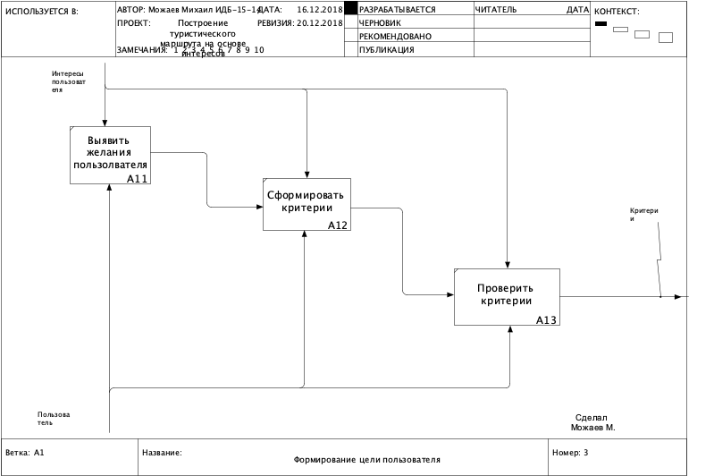

### DFD
#### A2

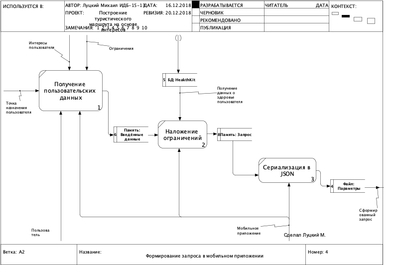

#### A3

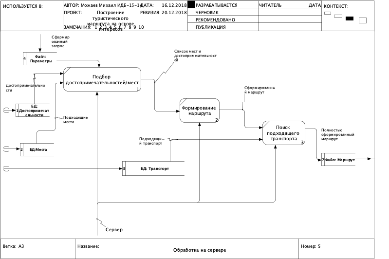

#### A4

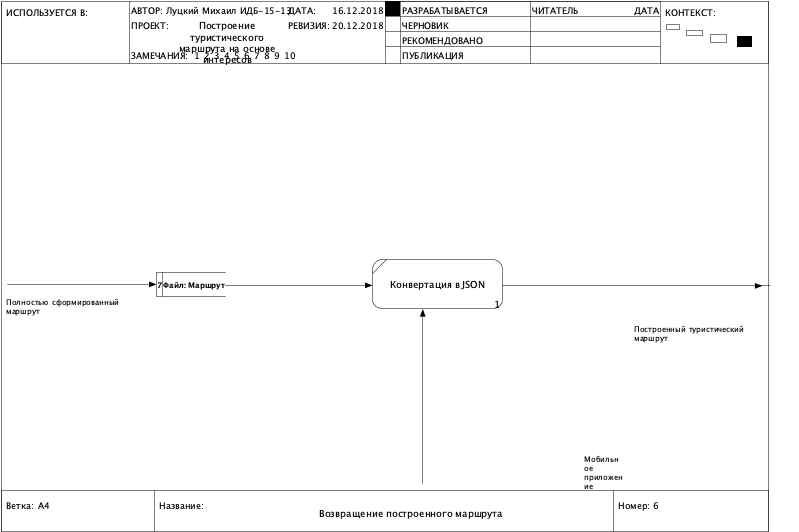

* Определение конфигурации технических средств: ПК для разработки; iOS-устройства iPhone для запуска приложения, сервер с ОС Linux, компьютер на Unix подобной ОС
* Определение конфигурации программных средств: Приложение будет разрабатываться в среде разработки (IDE) Xcode с использованием языков программирования Swift и Objective-C, а сервер в IDE VSCode на языке программирования Golang и Python
* Определение допустимых видов хранилищ и их размещения:

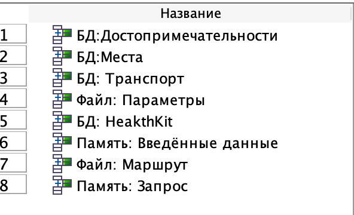

### ERD-ролей
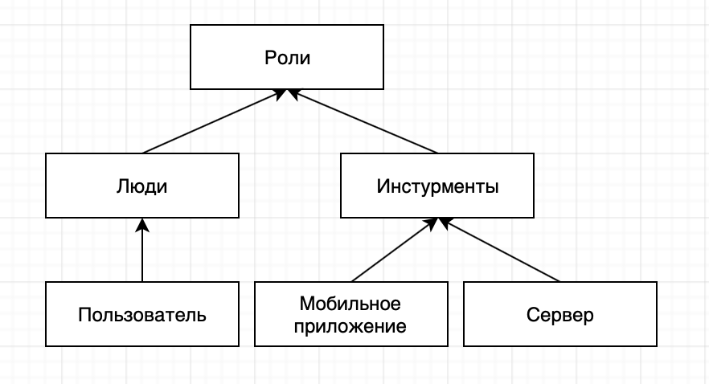

### ERD-потоков
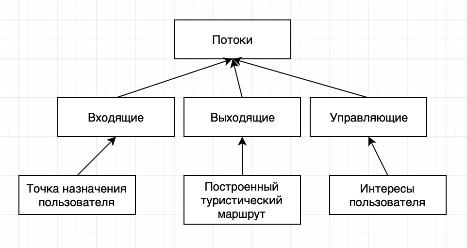

### ERD-модулей
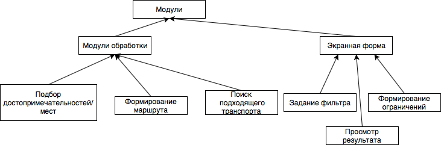

### Диаграмма последовательностей
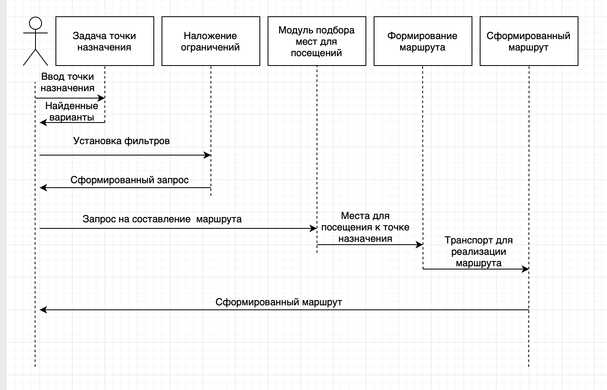

### Расчеты связанные с проектируемой системой
Определение числовых показателей для трудозатрат на разработку программных средств
Определение числа и сложности функциональных точек для модулей и для хранилищ:
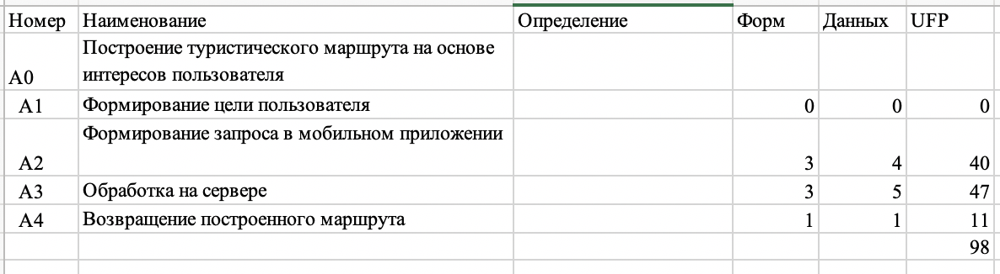
Расчет сложности разработки методом FPA/IFPUG:
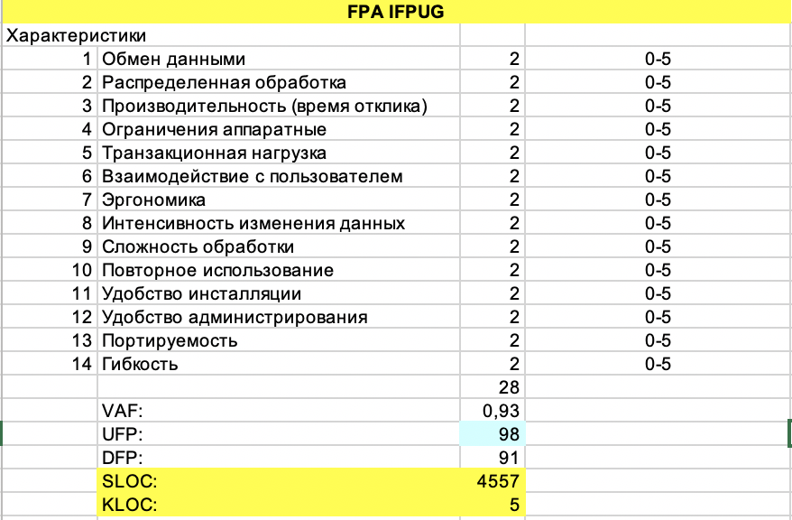
Расчет трудозатрат на разработку "с нуля" методом COCOMO II:
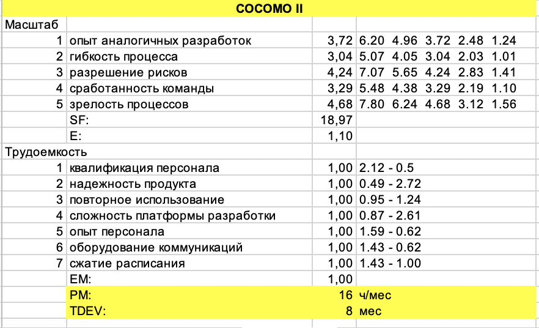

# Курсовая работа [Луцкий М.А.](https://github.com/loutskiy/loutskiy.github.io/blob/master/Kursovaya_Lutskii_M%20Овчинников.docx)
